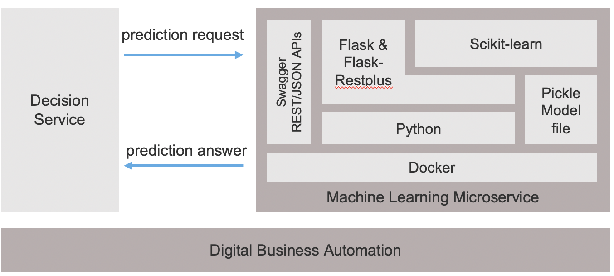

# A generic purpose ML micro service

### Moving forward a generic microservice to host any scikit-learn model. 

Technology stack is composed of Docker, Python, Flask, scikit-learn, and Joblib.

This microservice serves multiple ML models that are packaged in the Docker image. These ML models can even be placed out of the Docker image for more genericity.

We leverage Joblib to serialize the ML models augmented with metadata to help in their comsumption through a generic REST method.

On request arrival for prediction, a model like a Random Forest Classification one is loaded and run to predict a loan payment default.
Input parameters describing the loan are passed in JSON as the prediction returned by the service.
Same style of invocation for the classic Iris predictive model.


 
 
## Build the ML microservice
```console
docker build . -t ml-microservice  -f ./Dockerfile
```
## Run the ML microservice
```console
docker run -p 3000:5000 -d ml-microservice 
```
Your predictive service is ready to predict on the 127.0.0.1:3000 port.
Note that you can run the server without Docker by starting main.py on your local environment. In this case adress will be 0.0.0.0:5000.

## Check
```console
docker ps ml-microservice 
```
You should see a running container for miniloanpredictionservice image.

## Go to the OpenAPI descriptor page
The microservice publishes its REST methods through the OpenAPI standard.
You navidate to the OpenAPI page at the root of the wepp application.
```console
http://127.0.0.1:3000/ 
```
You should see a SwaggerUI layout listing the exposed REST methods.


Open the predictive method.


Fill input parameters in the UI to execute the REST endpoint.


After hitting the execute button you then gets the following screen.


Congratulations! You obtained a risk score computed by the scikit-learn ML model.
In the JSON response you see the probability of a payment default.

You can conduct other tests in the OpenAPI window, OpenAPI generated clients or through a curl command.

## Summary
You have experimented a lightweight approach to host a scikit-learn ML model and expose it through a REST method.
The Docker image includes the ML model prepared by a data scientist and shared as a pickle file.

Next step will consist in consuming the predictive REST method from an IBM Automation engine running your business logic.

 
With the following JSON request
```console
{
    "model":" {
        "name": toto",
        "version":"1.0",
        "format": "joblib"
        }
    "features": {
        "creditScore": "300",
        "income": "100000",
        "loanAmount": "570189",
        "monthDuration": "240",
        "rate": "0.07",
        "yearlyReimbursement": "57195"
    }
}
```
You should receive an answer like
```console
{
    "id": "123",
    "probabilities": {
        "0": 0.6717663255260751,
        "1": 0.32823367447392493
    }
}
```
