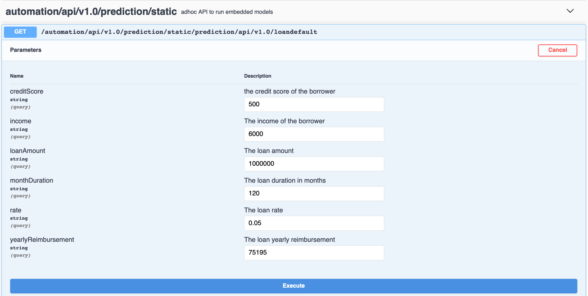
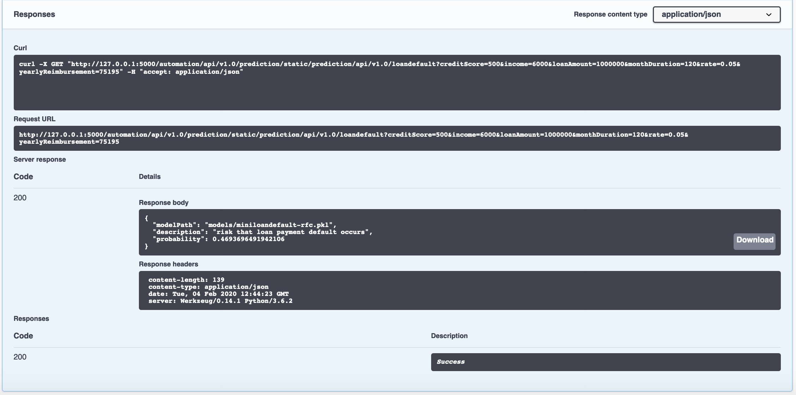

# Miniloan prediction micro service

A simple example of ML running microservice for real time machine learning based on Python, Flask, scikit-learn and Docker.
On request arrival for prediction, a Random Forest Classification model is loaded and run to predict a loan payment default.
Input parameters describing the loan are passed as HTTP parameters. Prediction is returned by the service.

 
 
## Build the ML microservice
```console
docker build . -t miniloanpredictionservice  -f ./Dockerfile
```
## Run the ML microservice
```console
docker run -p 3000:5000 -d miniloanpredictionservice 
```
Your predictive service is ready to predict on the 127.0.0.1:3000 port.
Note that you can run the server without Docker by starting main.py on your local environment. In this case adress will be 0.0.0.0:5000.

## Check
```console
docker ps miniloanpredictionservice 
```
You should see a running container for miniloanpredictionservice image.

## Go to OpenAPI descriptor page

```console
http://127.0.0.1:3000/ 
```
You should see a SwaggerUI layout listing the exposed REST methods.


Open the predictive method.


Fill input parameters in the UI to execute the REST endpoint.


Congratulations! You obtained a risk score computed by the scikit-learn ML model.


From there you can get a loan payment default risk score by sending an HTTP request.


```
Running locally the Docker container
```console
curl -X GET "http://127.0.0.1:3000/automation/api/v1.0/prediction/static/prediction/api/v1.0/loandefault?rate=0.05&yearlyReimbursement=12000&income=200000&monthDuration=120&creditScore=600&loanAmount=500000" -H  "accept: application/json"
 ```

```
You should receive an answer like
```console
{
    "id": "123",
    "probabilities": {
        "0": 0.6717663255260751,
        "1": 0.32823367447392493
    }
}
```
